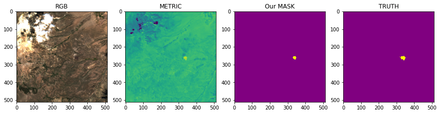

We construct a method to train a model to detect areas of burned land from Sentinel 2 images. 
It can be run on a personal computer with a GPU. 

## Prerequisites

Pytorch needs to be installed, preferably with CUDA 11

We work with the dataset provided by this [HuggingFace](https://huggingface.co/spaces/competitions/ChaBuD-ECML-PKDD2023) competition.

The dataset comprises patches of size 512x512 pixels collected from Sentinel-2
 L2A satellite mission. All reported forest fires are located in California. 
 For each area of interest, two images are provided: pre-fire acquisition and post-fire acquisition. 
 Each image is composed of 12 different channels, collecting information from the visible spectrum, infrared and ultrablue.

The dataset is split into:
 - train set
 - validation set
 - hidden test set, for which ground truth labels are not disclosed.
    
The hdf5 file is structured in this way:
     
    root
    |
    |- uuid_0: {"post_fire", "pre_fire", "mask"}
    | 
    |
    |- uuid_1: {"post_fire", "pre_fire", "mask"}
    |
    ...
     
Each uuid have associated an attribute called fold.

## Installation

Create a conda environment with the libraries in `requirements.txt`
We have used python 3.10.11 and torch==2.0.1+cu117 

## Method

We use transfer learning to train a uNet model on the [Analytical Burned Area Index](#references)
 (ABAI) for the given images.  

We can use the Sentinel 2 bands provided in the source files.

1. We calculate the ABAI(*) index, which shows a good detection of burned land areas 
2. We mask areas with water using the NDWI index 
3. We detect areas where active fire occurs using the SAHM (Structural Analysis of Hydrologic Modeling) index and mask them out in the ABAI metric

4. We use image augmentation 
5. We use standard deviation to enhance the metric contrast

6. We train a Resnet or a Deeplabv3 model on this metric by using Intersection over Union as score.

## Usage

Create folder 'data'
 - Copy the file train_eval.hd5f to this folder

run `preprocess_batch.py` 

 - loads the images from the .hd5f files 
 - calculates the metric with the functions in the Field class 
 - writes the metric as a .tiff file to `/data/processed/training_scene` (source)
 - writes the truth as a .tiff file to `/data/processed/truth_scene` (target)

run `preview_batch.py`
Previews the images inside the .hdf5 sourcefile

run `train_model.py`
Training of the model with pytorch using unet architecture (resnet, xception_net, and deeplab_v3)

run `verify predictions.py`
Visualizes the prediction with the truth mask by using the MakePrediction class functions

run `create_submission.py`
Prepares the .csv file to submit to the leaderboard

## Includes

`show_indexes.py`
    -   Visualises indexes on the pre- and post-fire scene.

`field.py`
    - Class that loads a uuid from the sourcefile and for any pair of images. 
    
        - returns NDVI and other indexes
        - returns index differences between pre- and post-fire scenes
        - returns the metric and mask 
        - returns a water mask         
        - returns a fire mask to exclude region with active fire 

`plotters.py` 
    - Class that loads a uuid from the sourcefile and plots: 
    
        - indexes such as NDVI,ABAI,BSI, ...
        - water mask and fire mask

`make_prediction.py`
    -   Class that calculates the metric for a single image input and makes the prediction with the selected model
 

## Results

We can visually verify how our model performs by looking at the plots.

For verfication we can run through the files with `verify_predictions.py`

  
On the left we see the original file in RGB 
Next we see the result of our metric, yellow indicates burned land area 
Next the resulting mask from our model 
On the right the truth mask 

## Limitations

Because the dataset has images where some burned areas have been contained in a previous pass by Sentinel satellites, they are also detected but not valid as truth. This imposed a problem that we coudln't overcome using this method.
A better approach would thus be to train the model on the provided bands without first using a metric.

Because the metric method proves reasonable results without this limitations, ie. if all burned areas would needed to be detected and not the ones from the labeled dataset, we were currently satisfied and didn't spend time and money on a more scientific approach. This would create a metric from the machine learning model's deep learning.

## References

(*) This repository makes use of the ABAI index, as presented in the following paper: 
 *Wu, B.; Zheng, H.; Xu, Z.; Wu, Z.; Zhao, Y. Forest Burned Area Detection Using a Novel Spectral Index Based on Multi-Objective Optimization. Forests 2022, 13, 1787. [https://doi.org/10.3390/f13111787](https://doi.org/10.3390/f13111787)*
